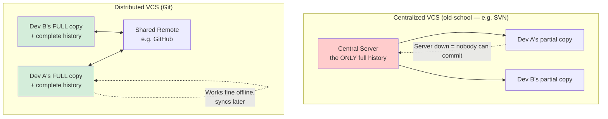

<div align="center">

# 🏠 Module 00 — Introduction & Setup


**Before you can commit code, you need to install a program, tell it your name, and understand why any of this matters. Let's go.**

</div>

---

## 📑 In This Module

- [Git Home — What Even Is This](#-git-home--what-even-is-this)
- [Git Intro — Version Control, Explained Like You're Five (a smart five-year-old)](#-git-intro--version-control-explained-like-youre-five-a-smart-five-year-old)
- [Git Install](#-git-install)
- [Git Config](#-git-config)
- [Git Get Started](#-git-get-started)
- [Git Help](#-git-help)
- [Glossary (Module 00 Terms)](#-glossary-module-00-terms)

---

## 🏠 Git Home — What Even Is This

**Git** is a program that tracks changes to files over time, so you can:
- See exactly what changed, when, and who changed it
- Go back to any earlier version, instantly, without asking anyone
- Let multiple people work on the same project without overwriting each other's work

It was created in 2005 by **Linus Torvalds** (yes, the Linux guy) because the tool the Linux
kernel team was using got revoked, and he — reportedly over a weekend — wrote something better
out of pure frustration. That origin story is worth remembering: Git wasn't designed by a
committee to look impressive on a resume. It was built by someone furious about losing work,
which is exactly the problem it still solves for you today.

> [!NOTE]
> **Git ≠ GitHub.** Git is the tool on your computer. GitHub is a website that hosts Git
> repositories online (so is GitLab, Bitbucket, etc.). You can use Git your entire career without
> ever touching GitHub. You just… usually won't, because sharing code is the whole point. Module
> 02 covers GitHub specifically — this module and Module 01 are 100% local, no internet required.

---

## 🧠 Git Intro — Version Control, Explained Like You're Five (a smart five-year-old)

### 🎭 The real-life example

Imagine you're writing a novel in Word. You save it. You write more. You save again — but you're
nervous, so you save it as `novel_v2.docx`. Then `novel_v2_final.docx`. Then, at 2am, three
months later: `novel_v2_final_ACTUALLY_FINAL_edits.docx`.

You now have 6 files, no idea which one has the good version of Chapter 4, and zero memory of
*why* you made most of these edits. This is version control by vibes, and it doesn't scale past
"one person, one file, mild panic."

**Version control** is a system that does this properly: every "save" (called a **commit**) is
timestamped, labeled with a message explaining *why*, and fully recoverable — forever, without
needing 47 filenames.

### 💻 The technical example

```bash
# Without Git: your folder, several months into a project
report.docx
report_v2.docx
report_v2_final.docx
report_FINAL_FINAL_useThisOne.docx

# With Git: your folder
report.docx

# ...and a full, searchable history living quietly in a hidden .git folder:
$ git log --oneline
a3f291c Fix typo in executive summary
7c88e02 Add Q3 revenue chart
4d9a110 Restructure section 2 per manager feedback
1b3e004 Initial draft
```

One file. Complete history. No guessing which one is "the real one" — it's always `report.docx`,
and the history tells you everything else.

### 🌐 Centralized vs. Distributed (the part interviewers actually ask about)



In a **centralized** system, only the server has the full history — if it goes down, nobody can
commit, and if it's lost, the history is gone. In **Git** (distributed), every single clone on
every developer's laptop has the *entire* project history. You can commit, browse history, and
create branches on a plane with no wifi, then sync everything up later. This single design
decision is why Git won.

---

## 🔧 Git Install

### macOS
```bash
# Easiest: via Homebrew
brew install git

# Or it may already be there — check first:
git --version
```

### Windows
Download and run the installer from [git-scm.com](https://git-scm.com/download/win) — this also
installs **Git Bash**, a terminal that behaves like Linux/Mac, which is genuinely worth using
instead of Command Prompt.

### Linux
```bash
# Debian/Ubuntu
sudo apt update && sudo apt install git

# Fedora
sudo dnf install git
```

### Verify it worked
```bash
git --version
# git version 2.43.0   ← any recent-ish version is fine
```

> [!TIP]
> If `git --version` fails with "command not found" after installing, close and reopen your
> terminal. This fixes it about 80% of the time — the terminal cached the old PATH before Git was
> added to it. (The other 20% of the time, you'll be Googling PATH environment variables at
> midnight. We've all been there.)

---

## ⚙️ Git Config

Before your first commit, Git needs to know **who you are** — this gets stamped onto every
commit you ever make, permanently.

### 🎭 The real-life example

It's like writing your name on the first page of a shared notebook before anyone starts using it.
Skip this step, and every entry in the notebook gets attributed to "unknown," or worse —
whatever placeholder name your operating system happens to be using.

### 💻 The technical example

```bash
# Set your identity — GLOBAL means "for every repo on this machine"
git config --global user.name "Ghanendra Yadav"
git config --global user.email "you@example.com"

# Set your default branch name (modern convention is "main", not "master")
git config --global init.defaultBranch main

# Check what you just set
git config --list
```

**Global vs. local config** — this trips up almost everyone eventually:

```bash
# GLOBAL: applies everywhere, set once
git config --global user.email "personal@example.com"

# LOCAL: applies ONLY to the current repo, overrides global
cd work-project/
git config user.email "you@company.com"
```

> [!WARNING]
> This is the classic "why do all my personal project commits show my work email" bug. If you
> use one email for work and one for personal projects, set the personal one as `--global` and
> override it with a `--local` (no flag) config inside your work repos specifically — not the
> other way around, unless you enjoy explaining commit history to HR.

---

## 🚀 Git Get Started

Time to actually create a repository.

### Step by step

```bash
# 1. Make a new folder and go into it
mkdir my-first-repo
cd my-first-repo

# 2. Turn it into a Git repository
git init
# Initialized empty Git repository in .../my-first-repo/.git/

# 3. Check what Git thinks is going on (you'll run this CONSTANTLY)
git status
# On branch main
# No commits yet
# nothing to commit (create/copy files and use "git add" to track)
```

That `.git` folder `git init` just created is where **all** of Git's magic lives — the entire
history, every branch, every commit. Delete that folder, and as far as Git is concerned, the
project's history never existed (the files themselves are untouched — only the tracking is gone).

> [!TIP]
> `git status` is the single most useful command in all of Git, and beginners chronically
> under-use it. Get in the habit of running it after *every* action — after creating files, after
> staging, after committing. It always tells you exactly what state you're in and, usually, the
> exact next command to run.

---

## 🆘 Git Help

You will forget commands. Everyone does, forever, including people with 15 years of Git
experience. That's fine — Git has help built in, no Googling required:

```bash
git help commit          # full documentation for the `commit` command
git commit --help        # identical — same thing, shorter to type
git commit -h            # a quick summary instead of the full manual

git help -a               # list EVERY Git command that exists (there are a lot)
git help -g               # list conceptual guides (e.g. "git help workflows")
```

> [!NOTE]
> `git help <command>` opens your system's manual-page viewer, which some people find clunky.
> `git <command> -h` gives you a fast, no-frills cheat sheet instead — usually the faster path
> when you just need to remember one flag.

---

## 📖 Glossary (Module 00 Terms)

| Term | Meaning |
|---|---|
| **Repository (repo)** | A project folder that Git is tracking — identifiable by the hidden `.git` folder inside it |
| **Version Control System (VCS)** | Software that tracks changes to files over time |
| **Distributed VCS** | A VCS where every clone has the complete history (Git's model) |
| **Commit** | A saved snapshot of your project at a point in time, with a message explaining why |
| **`git init`** | The command that turns an ordinary folder into a Git repository |
| **Global config** | Git settings that apply to every repository on your machine |
| **Local config** | Git settings that apply only to the current repository, overriding global |

---

## ✅ Quick Check-In

Before moving to Module 01, you should be able to answer these without looking back up:

1. What's the difference between Git and GitHub?
2. Why does Git's *distributed* model matter more than it sounds like it should?
3. What command shows you the current state of your repo, and how often should you run it?

If any of those feel shaky, that's completely normal for a first pass — skim back through, it'll
click. If you're solid on all three, you're ready for the module where things actually get typed
into files.

---

<div align="center">

**[⬆ Back to Top](#-module-00--introduction--setup)** | **[🏠 Main README](../README.md)** | **[Next: Git Fundamentals →](../01-git-fundamentals/)**

</div>
