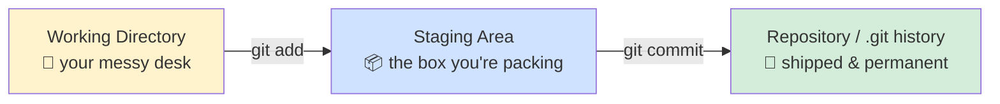
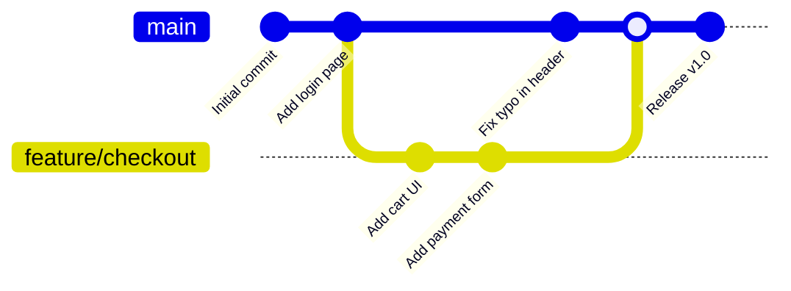
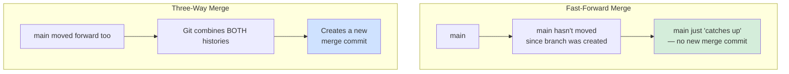
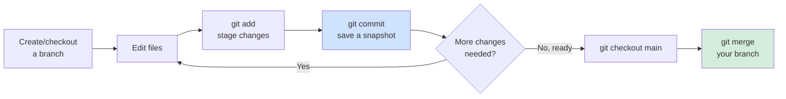

<div align="center" markdown="1">

# 🧬 Module 01 — Git Fundamentals


**This is the module. The one you'll actually use every single working day for the rest of your career. Everything after this is a specialization — this is the core.**

</div>

---

## 📑 In This Module

- [New Files — Tracked vs. Untracked](#-new-files--tracked-vs-untracked)
- [Staging — The Most Important Concept in Git](#-staging--the-most-important-concept-in-git)
- [Commit](#-commit)
- [History](#-history)
- [Tagging](#-tagging)
- [Stash](#-stash)
- [Branch](#-branch)
- [Merge](#-merge)
- [Workflow — Putting It All Together](#-workflow--putting-it-all-together)
- [Best Practices](#-best-practices)
- [Glossary (Module 01 Terms)](#-glossary-module-01-terms)

---

## 📄 New Files — Tracked vs. Untracked

When you create a new file inside a Git repo, Git notices it immediately — but doesn't track it
until *you* say so. This is deliberate: Git doesn't want to auto-track your `node_modules` folder,
your `.DS_Store` files, or your secret `notes_to_self_do_not_commit.txt`.

```bash
echo "console.log('hello world')" > app.js
git status
```
```
Untracked files:
  (use "git add <file>..." to include in what will be committed)
        app.js
```

**Untracked** = "Git sees this file exists, but has zero interest in it until you tell it
otherwise." This is a feature, not Git being lazy.

---

## 📦 Staging — The Most Important Concept in Git

### 🎭 The real-life example

You're packing a box to ship. Your desk (the **working directory**) has 20 items scattered
around. You don't ship your whole desk — you deliberately pick which items go **into the box**
(the **staging area**), inspect what's in the box one more time, and *then* seal and ship it (the
**commit**).

The staging area exists so you can build **exactly** the commit you want, even if your working
directory is a mess of five unrelated changes at once.



### 💻 The technical example

```bash
# You edited THREE files, but they're unrelated changes
echo "fix bug" >> login.js
echo "new feature" >> signup.js
echo "typo fix" >> readme.md

git status
# modified: login.js
# modified: signup.js
# modified: readme.md

# Stage ONLY the bug fix — not the other two, even though they're all "modified"
git add login.js

# Check the box before sealing it
git status
# Changes to be committed:
#     modified: login.js
# Changes not staged for commit:
#     modified: signup.js
#     modified: readme.md

git commit -m "fix: login validation bug"
# ^ Only login.js goes in. signup.js and readme.md are still sitting on your desk, untouched.
```

**Common staging commands:**
```bash
git add file.txt          # stage one specific file
git add file1.txt file2.txt  # stage multiple specific files
git add .                 # stage EVERYTHING changed (use carefully — see Best Practices below)
git add -p                # stage interactively, chunk by chunk within a single file (genuinely great)
git reset file.txt        # UN-stage a file (doesn't touch its actual content — just takes it back out of the box)
```

> [!TIP]
> `git add -p` is the most underrated command for beginners. It walks through every changed
> chunk in a file and asks "stage this part? y/n" — perfect for when you fixed a bug AND
> accidentally left a `console.log('here')` debug line in the same file, and want to commit only
> the fix.

---

## ✅ Commit

A commit is a permanent, timestamped snapshot with a message explaining **why** — not what (the
diff already shows what).

```bash
git commit -m "fix: prevent negative quantity in cart"

# Forgot to stage a file? Add it and amend the LAST commit instead of creating a new one:
git add forgotten-file.js
git commit --amend --no-edit
```

### 🎭 The real-life example

It's a video game checkpoint. You don't save every single pixel movement — you save at
meaningful moments ("cleared this level," "picked up the key item"), with a note to your future
self about what just happened. A commit message like `"stuff"` is the equivalent of naming every
save file `save1`, `save2`, `save3` — technically works, helps nobody, including future-you at
2am debugging a production issue.

### ✍️ A good commit message

```
❌ "fixed it"
❌ "asdasd"
❌ "final commit for real this time"

✅ "fix: prevent cart total from going negative on quantity underflow"
✅ "feat: add CSV export to transaction report"
✅ "refactor: extract validation logic into shared utility"
```

The convention `type: description` (feat/fix/refactor/docs/test/chore) isn't required by Git
itself, but it's so widely adopted that `git log --oneline --grep="fix:"` instantly showing every
bug fix in your project's history is now basically an industry standard trick.

---

## 📜 History

```bash
git log                    # full history: author, date, full message, commit hash
git log --oneline          # condensed: one line per commit — your daily driver
git log --oneline -5       # just the last 5 commits
git log --author="Ghanendra"  # filter by author
git log --grep="fix:"      # filter by commit message content
git log -p                 # show the actual code diff for each commit (verbose but powerful)
git log --graph --oneline --all  # ASCII branch visualization — genuinely useful before a merge
```

### 🎭 The real-life example

`git log` is your project's diary. Every entry has a date, an author, and a note about what
happened and why. Six months from now, when a bug appears out of nowhere and you're wondering
"wait, when did this logic change and why," `git log -p` on that file is how you find out —
without asking anyone or guessing.

```bash
# "When did this specific line last change, and why?" — asked constantly in real jobs
git log -p --follow -- path/to/file.js
```

---

## 🏷️ Tagging

Tags mark a specific commit as significant — almost always used for **releases**.

```bash
git tag v1.0.0                          # lightweight tag on the current commit
git tag -a v1.0.0 -m "First stable release"  # ANNOTATED tag — has its own message, author, date (use this one)
git tag                                 # list all tags
git push origin v1.0.0                  # tags don't push automatically — you push them explicitly
git push origin --tags                  # push ALL tags at once
```

### 🎭 The real-life example

If commits are diary entries, a tag is a bookmark that says **"this specific page is the one we
shipped to customers as Version 2.0."** Branches move forward constantly; tags don't move at all
— once set, `v1.0.0` always points at the exact same commit, forever, so you can always answer
"what code was actually in production on release day" with certainty.

---

## 🧳 Stash

### 🎭 The real-life example

Your boss is walking toward your desk *right now* and your code is a half-finished disaster you're
not ready to explain. You don't have time to commit it properly (it's not done!) and you can't
just leave it lying around either. `git stash` is shoving the mess into a closet, closing the
door, and looking normal by the time they arrive.

```bash
git stash                    # shove all current changes into the closet
git status                   # working directory is now clean — nothing to see here
git stash list                # what's actually in the closet
# stash@{0}: WIP on main: 4d9a110 last commit message

git stash pop                 # take the most recent stash back out AND remove it from the closet
git stash apply                # take it back out but KEEP a copy in the closet (rarely what you want)
git stash drop stash@{0}      # throw away a specific stash without applying it
git stash push -m "half-done payment form"  # stash WITH a note, for when you'll have multiple stashes
```

> [!WARNING]
> `git stash pop` can conflict if the branch has changed since you stashed — Git will tell you
> clearly if this happens, don't panic, it's the same conflict-resolution process as a merge
> conflict (covered below).

---

## 🌿 Branch

### 🎭 The real-life example

A branch is a parallel timeline. `main` is the "real," stable timeline everyone agrees is the
official story. When you want to try something risky — a new feature, an experiment, a fix you're
not 100% sure about — you create a **branch**: an alternate universe where you can break things
freely, without any risk to `main`, until you're confident enough to merge that universe back in.



### 💻 The technical example

```bash
git branch                        # list branches, * marks which one you're on
git branch feature/checkout       # create a new branch (doesn't switch to it yet)
git checkout feature/checkout     # switch to it
git checkout -b feature/checkout  # create AND switch in one command — what you'll actually use daily
git switch feature/checkout       # modern alternative to checkout, does the same switching job
git branch -d feature/checkout    # delete a branch (safe — refuses if it has unmerged work)
git branch -D feature/checkout    # force-delete (no safety check — know what you're doing)
```

> [!TIP]
> Branching in Git is genuinely, almost suspiciously cheap — it's just a pointer to a commit, not
> a full copy of your project. This is why Git culture encourages branching constantly (one
> branch per feature, per bug fix, per experiment) in a way that would've been unthinkably slow in
> older version control systems.

---

## 🔀 Merge

Once your branch's work is ready, you bring it back into `main`.

```bash
git checkout main              # go to the branch you want to merge INTO
git merge feature/checkout     # bring feature/checkout's changes into main
```

### Two kinds of merge, and why the difference matters



- **Fast-forward**: nobody touched `main` while you were on your branch — Git just moves `main`'s
  pointer forward to your latest commit. Clean, simple, no extra commit created.
- **Three-way merge**: `main` moved forward too (someone else merged something) — Git has to
  combine both histories, creating a dedicated **merge commit** that has two parents.

### 🎭 The real-life example

Two people edited the same shared document while offline, then reconnect. If one person made zero
changes, the other's version just "wins" cleanly (fast-forward). If **both** made changes, someone
(Git, automatically, usually successfully) has to intelligently combine both sets of edits into
one final document (three-way merge) — and if both edited the *exact same sentence* differently,
that's a **merge conflict**, which needs a human to decide. (Full conflict-resolution workflow is
in [Module 05](../05-advanced-git/).)

---

## 🔁 Workflow — Putting It All Together

Here's the loop you'll run dozens of times a day, forever:



```bash
git checkout -b feature/add-dark-mode
# ... edit files ...
git add .
git commit -m "feat: add dark mode toggle to settings"
# ... edit more files ...
git add styles.css
git commit -m "fix: dark mode contrast on buttons"
git checkout main
git merge feature/add-dark-mode
git branch -d feature/add-dark-mode
```

That's genuinely most of Git, in one loop. Everything else in this course is either a variation
on this loop (Module 02's GitHub push/pull), a safety net for when it goes wrong (Module 04), or
a specialization for specific situations (Module 05).

---

## 🧠 Best Practices

**Do:**
- ✔️ Commit small, focused changes — one logical change per commit, not "today's work" as one giant commit
- ✔️ Write commit messages that explain *why*, not just *what* (the diff shows what)
- ✔️ Run `git status` constantly — it always tells you exactly where you stand
- ✔️ Create a branch for anything beyond a one-line fix
- ✔️ Pull/fetch before you start new work, to avoid painful merge conflicts later

**Don't:**
- ✖️ `git add .` blindly without checking `git status` first — it stages EVERYTHING, including
  that debug file or `.env` you didn't mean to include
- ✖️ Commit directly to `main` for anything non-trivial — branches are free, use them
- ✖️ Write commit messages like "fix", "update", "asdf" — you will regret this at 11pm during an
  incident, guaranteed
- ✖️ Let a branch live for weeks without merging — the longer it diverges from `main`, the more
  painful the eventual merge conflict

---

## 📖 Glossary (Module 01 Terms)

| Term | Meaning |
|---|---|
| **Working Directory** | The actual files on your disk, as you're editing them right now |
| **Staging Area (Index)** | The "box you're packing" — changes selected to go into the next commit |
| **Commit** | A permanent, timestamped snapshot of the staged changes, with a message |
| **Branch** | An independent line of development — a pointer to a commit, cheap to create |
| **Fast-Forward Merge** | Merging when the target branch hasn't moved — no new commit needed |
| **Three-Way Merge** | Merging when both branches have new commits — creates a merge commit |
| **Merge Conflict** | When Git can't automatically combine two changes to the same lines — needs a human decision |
| **Stash** | A temporary, uncommitted "shelf" for changes you're not ready to commit yet |
| **Tag** | A permanent, non-moving pointer to a specific commit — almost always used for releases |

---

## ✅ Quick Check-In

1. Why does Git have a **staging area** at all, instead of just committing everything that's
   changed?
2. What's the actual difference between a fast-forward merge and a three-way merge?
3. You're mid-feature and need to quickly switch branches to fix an urgent bug — what command do
   you reach for *first*, before switching?

If #3 didn't immediately bring "`git stash`" to mind, that's worth a re-read of that section —
it's one of the most practically useful commands in this entire module.

---

<div align="center" markdown="1">

**[⬆ Back to Top](#-module-01--git-fundamentals)** | **[🏠 Main README](../README.md)** | **[← Previous: Introduction](../00-introduction/)** | **[Next: Git + GitHub →](../02-git-and-github/)**

</div>
