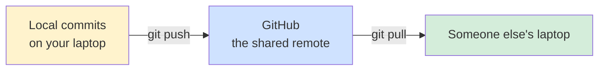
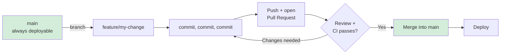

<div align="center">

# 🌐 Module 02 — Git + GitHub


**Everything in Module 01 happened entirely on your laptop. Now your laptop's Git learns to talk to the internet's Git.**

</div>

---

## 📑 In This Module

- [GitHub Get Started](#-github-get-started)
- [SSH — What It Is and Why You Need It](#-ssh--what-it-is-and-why-you-need-it)
- [Set Remote](#-set-remote)
- [Edit Code — the GitHub Web Editor](#-edit-code--the-github-web-editor)
- [Push to GitHub](#-push-to-github)
- [Pull from GitHub](#-pull-from-github)
- [GitHub Branch — Push/Pull a Branch](#-github-branch--pushpull-a-branch)
- [GitHub Flow](#-github-flow)
- [GitHub Pages](#-github-pages)
- [Git GUI Clients](#-git-gui-clients)
- [Glossary (Module 02 Terms)](#-glossary-module-02-terms)

---

## 🐙 GitHub Get Started

Create a free account at [github.com](https://github.com) if you haven't already. That's genuinely
it for "getting started" — the actual connection happens in the next section.

### 🎭 The real-life example

If Git is your personal notebook, GitHub is a shared filing cabinet in a building everyone on your
team has a key to. You can write in your own notebook privately all day — GitHub is what makes
that notebook something a team, or the entire internet, can read, copy, and contribute back to.

> [!NOTE]
> GitHub isn't the only such filing cabinet — **GitLab** and **Bitbucket** do the same job. Nearly
> everything in this module (remotes, push, pull, pull requests) applies to all three with minor
> naming differences ("merge request" on GitLab instead of "pull request"). GitHub just has the
> largest open-source gravity, so that's what we'll use.

---

## 🔑 SSH — What It Is and Why You Need It

### 🎭 The real-life example

Typing your GitHub password every single time you push code is like re-verifying your identity at
the front desk every time you walk to your own desk. **SSH keys** are a permanent ID badge: prove
who you are once, badge in silently forever after.

### 💻 The technical example

```bash
# 1. Generate a new SSH key pair (skip if you already have one)
ssh-keygen -t ed25519 -C "your_email@example.com"
# Press Enter through the prompts (default location is fine, passphrase optional but recommended)

# 2. Start the SSH agent and add your key
eval "$(ssh-agent -s)"
ssh-add ~/.ssh/id_ed25519

# 3. Copy your PUBLIC key (never share the private one!)
cat ~/.ssh/id_ed25519.pub
# Copy the entire output — starts with "ssh-ed25519 AAAA..."
```

**Add it to GitHub:** GitHub → Settings → SSH and GPG keys → New SSH key → paste it.

```bash
# 4. Verify it worked
ssh -T git@github.com
# "Hi <username>! You've successfully authenticated..."
```

> [!WARNING]
> There are TWO keys generated: `id_ed25519` (private — never share, never commit, never paste
> anywhere but your own machine) and `id_ed25519.pub` (public — this is the one that's safe to
> give to GitHub). Mixing these up is a genuine security incident, not a typo.

---

## 🔗 Set Remote

A **remote** is Git's name for "a copy of this repository living somewhere else" — almost always
on GitHub.

```bash
# Connect a local repo to a GitHub repo you already created (empty) on github.com
git remote add origin git@github.com:yourusername/your-repo.git

# Check what remotes are configured
git remote -v
# origin  git@github.com:yourusername/your-repo.git (fetch)
# origin  git@github.com:yourusername/your-repo.git (push)

# Change a remote's URL (e.g. switching from HTTPS to SSH)
git remote set-url origin git@github.com:yourusername/your-repo.git

# Remove a remote entirely
git remote remove origin
```

`origin` is just a **name** for the remote — a convention, not a keyword. You could name it
`banana` and Git wouldn't care. Everyone calls it `origin` because everyone else does, which is
its own kind of consistency worth keeping.

---

## ✏️ Edit Code — the GitHub Web Editor

For small changes, you don't always need to clone anything — GitHub has a built-in editor.
Navigate to any file in a repo you have write access to, click the pencil icon, edit, and commit
directly from the browser. Genuinely useful for a one-line README typo fix; genuinely not a
replacement for your actual dev workflow on anything real.

> [!TIP]
> Press `.` (just the period key) while viewing any GitHub repo to open it in a full **VS Code in
> the browser** (github.dev) — a lesser-known trick that's far more capable than the inline editor
> for anything beyond a one-line fix.

---

## ⬆️ Push to GitHub

```bash
git push origin main
# or, the first time on a new branch:
git push -u origin main    # -u sets the "upstream" — after this, just `git push` works
```

### 🎭 The real-life example

`git commit` saves a change to *your* notebook. `git push` is mailing a photocopy of your
notebook's new pages to the shared filing cabinet. Until you push, your commits exist only on
your machine — nobody else can see them, and if your laptop dies, they're gone with it.



> [!WARNING]
> `git push --force` overwrites the remote's history with yours, discarding anything there that
> you don't have locally. This is genuinely dangerous on a shared branch — it can erase a
> teammate's just-pushed work. `git push --force-with-lease` is the safer version: it refuses to
> push if the remote has changes you haven't seen yet, instead of blindly overwriting.

---

## ⬇️ Pull from GitHub

```bash
git pull origin main
# This is actually TWO commands combined:
#   1. git fetch  (download new commits, don't touch your working files yet)
#   2. git merge  (combine them into your current branch)

git fetch origin        # just step 1 alone — safe to run anytime, changes nothing locally
git log origin/main     # see what's new on the remote before merging it in
```

### 🎭 The real-life example

A teammate mailed updated pages to the shared filing cabinet. `git pull` is you going to the
cabinet, grabbing those new pages, AND immediately filing them into your own notebook in the
right place. `git fetch` alone is just "go look at the cabinet and see what's new" — without
touching your own notebook yet. Cautious people `fetch` first, review, then `merge` or `pull`.

---

## 🌿 GitHub Branch — Push/Pull a Branch

```bash
# Create a branch locally, then push it to GitHub for the first time
git checkout -b feature/new-navbar
git push -u origin feature/new-navbar

# Pull someone ELSE's branch that already exists on GitHub but not on your machine yet
git fetch origin
git checkout feature/their-branch
# Git is smart enough to auto-create a local tracking branch matching the remote one
```

Once pushed, that branch is visible to your whole team on GitHub — anyone can view its diff,
comment on it, or open a **pull request** from it (Module 03 goes deep on this).

---

## 🔄 GitHub Flow

**GitHub Flow** is the simple, widely-used branching model most teams actually use day to day
(as opposed to more elaborate models with permanent `develop`/`release` branches):



1. `main` is always in a deployable state
2. Every change gets its own branch, named descriptively
3. Push early, open a Pull Request even before it's finished (mark it "Draft") — visibility beats surprise
4. Once reviewed and CI is green, merge into `main`
5. `main` gets deployed

It's deliberately simpler than Git Flow (an older model with `develop`, `release/*`, `hotfix/*`
branches) — GitHub Flow assumes you can deploy frequently and safely, which most modern teams with
good CI/CD can.

---

## 📄 GitHub Pages

Free static website hosting, directly from a repo — this is genuinely how a lot of portfolio
sites, documentation sites, and project pages get hosted for $0.

```bash
# Enable via GitHub: Settings → Pages → choose branch (usually `main`) and folder (`/` or `/docs`)
# Your site is live at: https://yourusername.github.io/your-repo-name/
```

> [!TIP]
> If you're publishing a personal portfolio site, name the repo exactly
> `yourusername.github.io` — GitHub treats that specific repo name as your **root** site
> (`https://yourusername.github.io/`, no `/repo-name/` suffix), instead of a per-project page.

---

## 🖱️ Git GUI Clients

Everything in this course is command-line, deliberately — it's the version that works identically
everywhere and the one that actually builds understanding. But plenty of real, competent
developers use a GUI daily once they already understand what's happening underneath:

| Tool | Best For |
|---|---|
| **GitHub Desktop** | Simplicity, official GitHub integration, beginners |
| **GitKraken** | Visual branch/merge history — genuinely great for untangling a messy history |
| **Sourcetree** | Free, powerful, a bit more complex UI |
| **VS Code's built-in Git panel** | Convenient if you're already living in VS Code all day |
| **`lazygit`** (terminal UI) | For people who want speed without leaving the terminal |

> [!IMPORTANT]
> Learn the command line first. A GUI that abstracts away `git rebase` or a merge conflict is
> genuinely useful once you *understand* what it's doing for you — but if you only ever click
> buttons, the first time something breaks in a way the GUI doesn't have a button for, you're
> stuck. This entire course is CLI-first for exactly that reason.

---

## 📖 Glossary (Module 02 Terms)

| Term | Meaning |
|---|---|
| **Remote** | A named reference to a copy of the repository hosted elsewhere (e.g. `origin`) |
| **SSH Key** | A cryptographic key pair that authenticates you to GitHub without a password each time |
| **Push** | Upload local commits to a remote |
| **Fetch** | Download remote commits without merging them into your working branch |
| **Pull** | Fetch + merge, combined into one command |
| **Upstream** | The remote branch a local branch is linked to and tracks |
| **GitHub Flow** | A simple branch-per-feature workflow: branch → commit → PR → review → merge → deploy |
| **GitHub Pages** | Free static site hosting directly from a GitHub repository |

---

## ✅ Quick Check-In

1. What's the actual difference between `git fetch` and `git pull`?
2. Why is `git push --force-with-lease` safer than `git push --force`?
3. In GitHub Flow, at what point should you open a Pull Request — only when the work is 100%
   finished, or earlier?

If #3 surprised you, that's the most commonly-missed point in this whole module — opening a PR
early (as a Draft) is a feature, not a mistake, because it makes your in-progress work visible for
early feedback instead of a surprise 400-line diff at the end.

---

<div align="center">

**[⬆ Back to Top](#-module-02--git--github)** | **[🏠 Main README](../README.md)** | **[← Previous: Git Fundamentals](../01-git-fundamentals/)** | **[Next: Contributing to Open Source →](../03-contributing-to-open-source/)**

</div>
