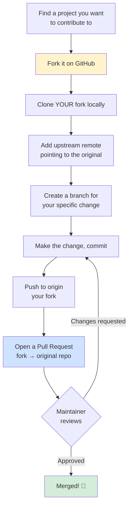

<div align="center">

# 🤝 Module 03 — Contributing to Open Source


**The exact sequence behind literally every "fixed a typo in a famous project" screenshot you've ever seen on LinkedIn.**

</div>

---

## 📑 In This Module

- [Fork — Your Own Copy of Someone Else's Repo](#-fork--your-own-copy-of-someone-elses-repo)
- [Clone from GitHub](#-clone-from-github)
- [Send a Pull Request](#-send-a-pull-request)
- [The Full Contribution Flow, End to End](#-the-full-contribution-flow-end-to-end)
- [Glossary (Module 03 Terms)](#-glossary-module-03-terms)

---

## 🍴 Fork — Your Own Copy of Someone Else's Repo

### 🎭 The real-life example

You don't have the keys to someone else's house, but you can photocopy their blueprint and build
your own version on your own land. A **fork** is GitHub creating a full copy of someone else's
repository **under your own account** — you own this copy completely, can do anything you want
to it, and none of it affects the original until you explicitly propose changes back.

### 💻 The technical example

On GitHub: open the repo you want to contribute to → click **Fork** (top right) → GitHub creates
`github.com/yourusername/their-repo` as a full copy, including its entire history.

You do **not** have push access to the original repo — that's the entire point of forking. It's
how strangers on the internet can propose changes to projects they don't have write access to,
without any risk to the original.

---

## 📥 Clone from GitHub

Now bring **your fork** down to your own machine to actually work on it:

```bash
git clone git@github.com:yourusername/their-repo.git
cd their-repo

# Add the ORIGINAL repo as a second remote, conventionally named "upstream"
git remote add upstream git@github.com:original-owner/their-repo.git
git remote -v
# origin    git@github.com:yourusername/their-repo.git (your fork)
# upstream  git@github.com:original-owner/their-repo.git (the real original)
```

### 🎭 The real-life example

`origin` is your photocopy of the blueprint — you push your changes here. `upstream` is the
original architect's blueprint — you only ever **pull** from here, to stay in sync with what the
real project is doing while you work. Confusing these two is the single most common beginner
mistake in open-source contribution: pushing to `upstream` will just fail (you don't have
permission), but *pulling from origin* thinking it's `upstream` means you silently miss weeks of
the real project's progress.

```bash
# Keep your fork in sync with the real project regularly
git fetch upstream
git checkout main
git merge upstream/main
git push origin main    # update YOUR fork's copy on GitHub too
```

---

## 📬 Send a Pull Request

```bash
# 1. Create a branch for your specific change — never work directly on main
git checkout -b fix/typo-in-readme

# 2. Make your change, commit it
git add README.md
git commit -m "docs: fix typo in installation instructions"

# 3. Push to YOUR fork (origin), not upstream
git push -u origin fix/typo-in-readme
```

**4. Open the Pull Request on GitHub:** navigate to your fork, GitHub will show a banner offering
to "Compare & pull request" for your just-pushed branch. Click it, write a clear title and
description explaining **what** changed and **why**, and submit.

### 🎭 The real-life example

A pull request is a formal, reviewable proposal: "here's a specific change I made to my copy —
please consider merging it into yours." The project maintainer reviews it, may ask for changes
(you just push more commits to the same branch — the PR updates automatically), and eventually
either merges it or closes it.

### ✍️ Writing a PR that actually gets merged

```markdown
## What
Fixes a broken installation command in the README (missing `--save-dev` flag).

## Why
Following the current instructions installs the package globally instead of as a
dev dependency, which breaks the project's own build script.

## How I tested it
Ran the corrected command on a fresh clone — build script now completes successfully.
```

> [!TIP]
> Small, focused PRs get merged fast. A PR that fixes one typo gets reviewed in 30 seconds. A PR
> that "also refactored some other stuff while I was in there" makes the maintainer's job much
> harder, and sits unreviewed far longer. If you notice something else worth fixing, that's a
> **second** PR, not scope creep on the first one.

---

## 🔁 The Full Contribution Flow, End to End



That's genuinely the entire mechanism behind every open-source contribution you've ever seen —
from a one-line typo fix to a massive feature added to a project with a million users. The
*process* is identical; only the size of the diff changes.

> [!NOTE]
> **Don't know where to start?** Look for issues labeled `good first issue` — most active
> open-source projects tag beginner-friendly issues specifically so new contributors have a clear,
> low-risk entry point. It's a genuinely great way to build a real, public contribution history.

---

## 📖 Glossary (Module 03 Terms)

| Term | Meaning |
|---|---|
| **Fork** | Your own full copy of someone else's repository, under your GitHub account |
| **Upstream** | Convention name for a remote pointing at the original repo you forked from |
| **Origin** (in a fork context) | Convention name for the remote pointing at YOUR fork |
| **Pull Request (PR)** | A formal, reviewable proposal to merge changes from one branch/fork into another |
| **`good first issue`** | A common label maintainers use to flag beginner-friendly contribution opportunities |

---

## ✅ Quick Check-In

1. What's the actual difference between `origin` and `upstream` in a fork-based workflow?
2. Why does a small, focused PR get merged faster than a large one that "also cleaned up a few
   other things"?
3. You just pushed a fix, but the maintainer asked for a small change — do you close this PR and
   open a new one, or do something else?

(#3: just commit the fix and push to the *same* branch — the existing PR updates automatically.
Opening a new PR for review feedback is a surprisingly common beginner instinct, and it's
unnecessary extra noise for the maintainer.)

---

<div align="center">

**[⬆ Back to Top](#-module-03--contributing-to-open-source)** | **[🏠 Main README](../README.md)** | **[← Previous: Git + GitHub](../02-git-and-github/)** | **[Next: Undo & Recovery →](../04-undo-and-recovery/)**

</div>
