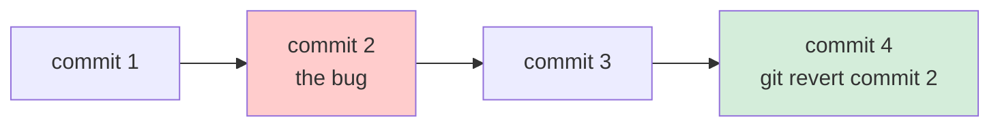
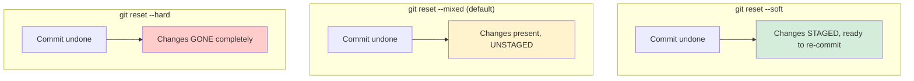
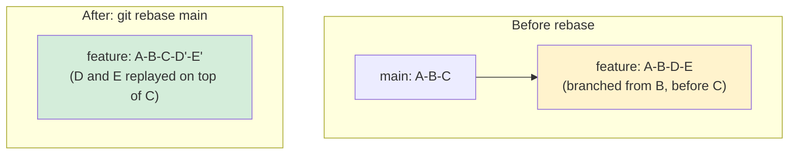

<div align="center">

# ↩️ Module 04 — Undo & Recovery


**"I think I just deleted three days of work" is a sentence that should never end in actual panic. This module is why.**

</div>

---

## 📑 In This Module

- [Revert — Undo Publicly, Safely](#-revert--undo-publicly-safely)
- [Reset — Rewrite History Locally](#-reset--rewrite-history-locally)
- [Amend](#-amend)
- [Rebase](#-rebase)
- [Reflog — The Undo Button for Your Undo Button](#-reflog--the-undo-button-for-your-undo-button)
- [Recovery Scenarios, Worked](#-recovery-scenarios-worked)
- [Glossary (Module 04 Terms)](#-glossary-module-04-terms)

---

## ⏪ Revert — Undo Publicly, Safely

```bash
git revert <commit-hash>
```

### 🎭 The real-life example

You published a typo in a printed newspaper. You can't un-print the papers already delivered — but
you **can** publish a correction the next day, clearly stating "yesterday's article had an error,
here's the fix." `git revert` doesn't erase the bad commit from history — it creates a **new**
commit that undoes its changes, leaving a clear, honest trail: "this happened, and here's the
fix," rather than pretending it never happened.



**This is why `revert` is the safe choice for anything already pushed and shared** — it doesn't
rewrite history other people may have already pulled, so nobody's local copy gets confused.

---

## ⏮️ Reset — Rewrite History Locally

```bash
git reset --soft HEAD~1    # undo the last commit, KEEP changes staged
git reset --mixed HEAD~1   # undo the last commit, KEEP changes but UNSTAGE them (this is the default)
git reset --hard HEAD~1    # undo the last commit, DISCARD the changes completely
```

### 🎭 The real-life example

You tore the last page out of your notebook.
- `--soft`: the page is torn out, but you're holding it in your hand, ready to rewrite it onto a
  fresh page immediately (changes are staged, ready to re-commit).
- `--mixed`: the page is torn out and sitting on your desk, unsorted (changes exist, unstaged).
- `--hard`: the page is torn out and shredded. Gone. (Genuinely gone, unless you know about
  `reflog` — see below.)



> [!WARNING]
> **`git reset --hard` is the most dangerous common Git command.** It discards uncommitted changes
> with zero confirmation, zero undo prompt. Before running it, `git status` first, always — if
> there's anything you're not 100% ready to lose, `git stash` it instead (Module 01).

### Revert vs. Reset — the actual decision

| | `git revert` | `git reset` |
|---|---|---|
| Rewrites shared history? | No — adds a new commit | Yes — moves history backward |
| Safe on a pushed/shared branch? | ✅ Yes | ❌ No — never reset a branch others have pulled |
| Safe on your own local, unpushed work? | Overkill, but fine | ✅ Yes — this is exactly what it's for |

---

## 🔧 Amend

```bash
git commit --amend -m "corrected commit message"
# Forgot to include a file?
git add forgotten-file.js
git commit --amend --no-edit    # keep the same message, just add the file
```

### 🎭 The real-life example

You just sealed and mailed a package, then immediately realized you forgot to include one item.
`--amend` doesn't send a *second* package — it un-seals the one you just sent, adds the missing
item, and reseals it as if it was always right. This **only** works cleanly on the last commit,
and **only** before you've pushed it — amending a commit that's already been pushed and pulled by
someone else creates the exact "rewriting shared history" problem `revert` exists to avoid.

---

## 🌱 Rebase

```bash
git checkout feature/my-branch
git rebase main
```

### 🎭 The real-life example

Imagine your branch is a rough draft you started from an old outline. `main` has since been
revised with new chapters. `git rebase` **replays your changes on top of the newest outline**, as
if you'd started your draft today instead of last week — resulting in a clean, linear history
with no messy "merge commit" documenting the back-and-forth.



**Merge vs. rebase — genuinely one of the most debated topics in all of Git:**

| | Merge | Rebase |
|---|---|---|
| History shape | Preserves exact chronological reality, including a merge commit | Clean, linear, as if it happened in one continuous line |
| Safe on a shared/pushed branch? | ✅ Always safe | ❌ Rewrites commit hashes — dangerous if others have pulled it |
| Best for | Integrating a finished feature branch into `main` | Cleaning up YOUR OWN local branch before opening a PR |

> [!IMPORTANT]
> **The golden rule of rebase: never rebase a branch other people are also working on.** Rebase
> rewrites every commit's hash from the rebase point forward. If someone else already has the old
> commits, their history and yours now permanently disagree, and reconciling that is a genuinely
> painful mess. Rebase your own local, not-yet-shared work freely — never rebase `main`.

---

## 🕵️ Reflog — The Undo Button for Your Undo Button

```bash
git reflog
# 8f3a921 (HEAD -> main) HEAD@{0}: reset: moving to HEAD~1
# a29c001 HEAD@{1}: commit: add payment validation
# 7c88e02 HEAD@{2}: commit: fix typo
# ...

# Found the commit you accidentally lost? Bring it back:
git reset --hard HEAD@{1}
# or, safer — create a new branch pointing at it, don't touch your current branch:
git branch recovery-branch HEAD@{1}
```

### 🎭 The real-life example

`reflog` is a security camera pointed at your `HEAD` pointer, recording **every single place it's
ever been** — every commit, every reset, every rebase, every checkout — even ones that are no
longer reachable from any branch. That "shredded" page from `git reset --hard` above? It's not
actually gone. It's sitting in Git's internal object database, unreferenced by any branch, and
`reflog` is how you find your way back to it.

> [!TIP]
> **This is genuinely the single most valuable command in this entire module.** Ran a `reset
> --hard` you immediately regretted? Botched a rebase? `git reflog` first, always, before assuming
> anything is truly, permanently lost. Reflog entries do eventually expire (default 90 days for
> reachable commits, 30 for unreachable) — but that's an enormous safety window for "I just did
> this 30 seconds ago."

---

## 🚑 Recovery Scenarios, Worked

**"I committed to the wrong branch"**
```bash
git log --oneline -1              # note the commit hash
git reset --hard HEAD~1           # remove it from the wrong branch
git checkout correct-branch
git cherry-pick <that-commit-hash>  # apply it to the right one
```

**"I deleted a branch and need it back"**
```bash
git reflog                        # find the last commit hash the deleted branch pointed to
git branch recovered-branch <hash>
```

**"I ran `reset --hard` and lost uncommitted work"**
```bash
# Unfortunately: reflog only helps with COMMITTED work.
# Uncommitted changes discarded by --hard are NOT in reflog — this is the one true "gone" scenario.
# This is exactly why "commit often, even messy WIP commits" beats "wait until it's perfect."
```

> [!WARNING]
> That last scenario is the one real gap in Git's safety net: **reflog protects commits, not
> uncommitted changes.** This is the strongest possible argument for committing early and often —
> even an ugly `"wip: half done, don't judge"` commit is fully recoverable. Uncommitted work that
> gets discarded is genuinely gone.

---

## 📖 Glossary (Module 04 Terms)

| Term | Meaning |
|---|---|
| **Revert** | Undo a commit by creating a new commit that reverses it — history-safe |
| **Reset** | Move the current branch pointer backward — soft/mixed/hard control what happens to the changes |
| **Amend** | Modify the most recent commit instead of creating a new one — only safe pre-push |
| **Rebase** | Replay commits on top of a new base, producing linear history — only safe on unshared branches |
| **Reflog** | A log of every place `HEAD` has ever pointed, including "lost" commits — Git's real safety net |
| **Cherry-pick** | Apply one specific commit from anywhere onto your current branch |

---

## ✅ Quick Check-In

1. You already pushed a bad commit and a teammate has pulled it — do you `revert` or `reset`, and
   why?
2. What's the one thing `reflog` **cannot** recover, and what habit protects you from that gap?
3. Why is rebasing a branch other people are also working on specifically dangerous?

If #2 didn't immediately bring "uncommitted changes, protected by committing often" to mind,
that's the single most practically important lesson in this entire module — worth re-reading the
Reflog section above.

---

<div align="center">

**[⬆ Back to Top](#-module-04--undo--recovery)** | **[🏠 Main README](../README.md)** | **[← Previous: Contributing to Open Source](../03-contributing-to-open-source/)** | **[Next: Advanced Git →](../05-advanced-git/)**

</div>
