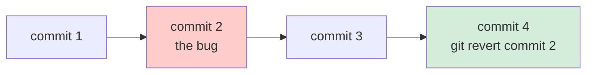
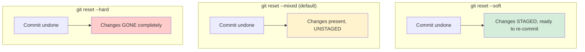
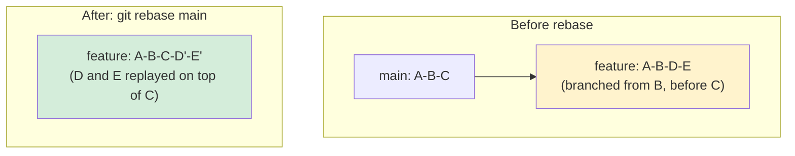

<div align="center" markdown="1">

# ↩️ Module 04 — Undo & Recovery


**"I think I just deleted three days of work" is a sentence that should never end in actual panic. This module is why.**

</div>

<div class="callout callout-concept" markdown="1">

**By the end of this module you will be able to:**

✓ Choose correctly between `revert` and `reset` based on whether history is shared
✓ Explain what `--soft`/`--mixed`/`--hard` actually do to your changes, not just recite the flags
✓ Fix the last commit cleanly with `--amend`, before it's pushed
✓ Use `reflog` to recover a commit you were sure was gone forever
✓ Walk through 7 realistic Git disasters and fix every one of them yourself

</div>

> [!CAUTION]
> This module teaches commands that can discard real work. Do every Try It and Lab below in
> `~/git-playground` (from [Module 00](../00-introduction/#-set-up-your-safe-sandbox)), never in
> a repo you actually care about, until the commands are second nature.

---

## 📑 In This Module

- [Revert — Undo Publicly, Safely](#-revert--undo-publicly-safely)
- [Reset — Rewrite History Locally](#-reset--rewrite-history-locally)
- [Amend](#-amend)
- [Rebase](#-rebase)
- [Reflog — The Undo Button for Your Undo Button](#-reflog--the-undo-button-for-your-undo-button)
- [💥 Disaster Labs](#-disaster-labs)
- [Glossary (Module 04 Terms)](#-glossary-module-04-terms)

---

## ⏪ Revert — Undo Publicly, Safely

```bash
git revert <commit-hash>
```

### 🎭 The real-life example

You published a typo in a printed newspaper. You can't un-print the papers already delivered — but
you **can** publish a correction the next day, clearly stating "yesterday's article had an error,
here's the fix." `git revert` doesn't erase the bad commit from history — it creates a **new**
commit that undoes its changes, leaving a clear, honest trail: "this happened, and here's the
fix," rather than pretending it never happened.


```mermaid
graph LR
    A[commit 1] --> B[commit 2<br/>the bug] --> C[commit 3] --> D["commit 4<br/>git revert commit 2"]

    style B fill:#ffcccc
    style D fill:#d4edda
```

**This is why `revert` is the safe choice for anything already pushed and shared** — it doesn't
rewrite history other people may have already pulled, so nobody's local copy gets confused.

<div class="callout callout-tryit" markdown="1">

**⌨️ TRY IT YOURSELF** (in `~/git-playground`)

```bash
echo "a deliberate bug" >> app.js
git add app.js
git commit -m "feat: add a feature (with a bug)"
git log --oneline -1          # note this commit's hash
git revert --no-edit HEAD
git log --oneline -3
```

**What should I see?** A brand new commit on top, undoing the previous one — the "buggy" line is
gone from `app.js`, but both commits are still visible in `git log`. Nothing was erased.

</div>

---

## ⏮️ Reset — Rewrite History Locally

```bash
git reset --soft HEAD~1    # undo the last commit, KEEP changes staged
git reset --mixed HEAD~1   # undo the last commit, KEEP changes but UNSTAGE them (this is the default)
git reset --hard HEAD~1    # undo the last commit, DISCARD the changes completely
```

### 🎭 The real-life example

You tore the last page out of your notebook.
- `--soft`: the page is torn out, but you're holding it in your hand, ready to rewrite it onto a
  fresh page immediately (changes are staged, ready to re-commit).
- `--mixed`: the page is torn out and sitting on your desk, unsorted (changes exist, unstaged).
- `--hard`: the page is torn out and shredded. Gone. (Genuinely gone, unless you know about
  `reflog` — see below.)


```mermaid
graph TB
    subgraph "git reset --soft"
        S1[Commit undone] --> S2[Changes STAGED, ready to re-commit]
    end
    subgraph "git reset --mixed (default)"
        M1[Commit undone] --> M2[Changes present, UNSTAGED]
    end
    subgraph "git reset --hard"
        H1[Commit undone] --> H2[Changes GONE completely]
    end
    style S2 fill:#d4edda
    style M2 fill:#fff3cd
    style H2 fill:#ffcccc
```

> [!WARNING]
> **`git reset --hard` is the most dangerous common Git command.** It discards uncommitted changes
> with zero confirmation, zero undo prompt. Before running it, `git status` first, always — if
> there's anything you're not 100% ready to lose, `git stash` it instead (Module 01).

### Revert vs. Reset — the actual decision

| | `git revert` | `git reset` |
|---|---|---|
| Rewrites shared history? | No — adds a new commit | Yes — moves history backward |
| Safe on a pushed/shared branch? | ✅ Yes | ❌ No — never reset a branch others have pulled |
| Safe on your own local, unpushed work? | Overkill, but fine | ✅ Yes — this is exactly what it's for |

<div class="danger-badge">⚠️ Destructive command</div>

<div class="callout callout-tryit" markdown="1">

**⌨️ TRY IT YOURSELF** (in `~/git-playground` — this one discards changes on purpose)

```bash
echo "temporary experiment" >> app.js && git add app.js && git commit -m "wip: experiment"
git reset --soft HEAD~1
git status            # staged, ready to re-commit — nothing lost

echo "temporary experiment" >> app.js && git add app.js && git commit -m "wip: experiment"
git reset --mixed HEAD~1
git status            # the change exists but is UNSTAGED — still nothing lost

echo "temporary experiment" >> app.js && git add app.js && git commit -m "wip: experiment"
git reset --hard HEAD~1
git status            # clean — the change is genuinely gone from app.js
```

**What should I see?** The exact same commit, undone three different ways — `git status` showing
staged, then unstaged, then nothing at all. That progression *is* the whole lesson: same command,
one flag, three completely different outcomes for your actual work.

</div>

---

## 🔧 Amend

```bash
git commit --amend -m "corrected commit message"
# Forgot to include a file?
git add forgotten-file.js
git commit --amend --no-edit    # keep the same message, just add the file
```

### 🎭 The real-life example

You just sealed and mailed a package, then immediately realized you forgot to include one item.
`--amend` doesn't send a *second* package — it un-seals the one you just sent, adds the missing
item, and reseals it as if it was always right. This **only** works cleanly on the last commit,
and **only** before you've pushed it — amending a commit that's already been pushed and pulled by
someone else creates the exact "rewriting shared history" problem `revert` exists to avoid.

<div class="callout callout-tryit" markdown="1">

**⌨️ TRY IT YOURSELF** (in `~/git-playground`)

```bash
git commit --allow-empty -m "fx: typo in this very message"
git log --oneline -1          # note this hash
git commit --amend -m "fix: corrected commit message"
git log --oneline -1          # the message is fixed...
git log --oneline -2          # ...but there's still only ONE commit here, not two
```

**What should I see?** The commit message corrected, and a *different* hash than before —
`--amend` doesn't edit the old commit in place, it replaces it with a brand new commit object and
moves the branch pointer to it. `git log --oneline -2` confirms there's still exactly one commit
here, not a correction stacked on top of the original.

</div>

---

## 🌱 Rebase

```bash
git checkout feature/my-branch
git rebase main
```

### 🎭 The real-life example

Imagine your branch is a rough draft you started from an old outline. `main` has since been
revised with new chapters. `git rebase` **replays your changes on top of the newest outline**, as
if you'd started your draft today instead of last week — resulting in a clean, linear history
with no messy "merge commit" documenting the back-and-forth.


```mermaid
graph TB
    subgraph "Before rebase"
        A1[main: A-B-C] --> A2["feature: A-B-D-E<br/>(branched from B, before C)"]
    end
    subgraph "After: git rebase main"
        C1["feature: A-B-C-D'-E'<br/>(D and E replayed on top of C)"]
    end
    style A2 fill:#fff3cd
    style C1 fill:#d4edda
```

**Merge vs. rebase — genuinely one of the most debated topics in all of Git:**

| | Merge | Rebase |
|---|---|---|
| History shape | Preserves exact chronological reality, including a merge commit | Clean, linear, as if it happened in one continuous line |
| Safe on a shared/pushed branch? | ✅ Always safe | ❌ Rewrites commit hashes — dangerous if others have pulled it |
| Best for | Integrating a finished feature branch into `main` | Cleaning up YOUR OWN local branch before opening a PR |

> [!IMPORTANT]
> **The golden rule of rebase: never rebase a branch other people are also working on.** Rebase
> rewrites every commit's hash from the rebase point forward. If someone else already has the old
> commits, their history and yours now permanently disagree, and reconciling that is a genuinely
> painful mess. Rebase your own local, not-yet-shared work freely — never rebase `main`.

<div class="callout callout-tryit" markdown="1">

**⌨️ TRY IT YOURSELF** (in `~/git-playground`)

```bash
git switch main
git switch -c feature/rebase-practice
echo "feature work" >> feature.js && git add feature.js && git commit -m "feat: feature work"

git switch main
echo "main moved forward" >> readme.md && git add readme.md && git commit -m "docs: update readme"

git log --oneline --graph --all     # two diverged branches, same starting point
git switch feature/rebase-practice
git rebase main                     # replay feature's commit on top of main's latest
git log --oneline --graph --all     # now a straight line — no merge commit
```

**What should I see?** Before the rebase, `--graph` shows two separate lines diverging. After,
one straight line — `feature/rebase-practice`'s commit now sits directly on top of `main`'s, as
if it had been written after it, not alongside it.

</div>

---

## 🕵️ Reflog — The Undo Button for Your Undo Button

```bash
git reflog
# 8f3a921 (HEAD -> main) HEAD@{0}: reset: moving to HEAD~1
# a29c001 HEAD@{1}: commit: add payment validation
# 7c88e02 HEAD@{2}: commit: fix typo
# ...

# Found the commit you accidentally lost? Bring it back:
git reset --hard HEAD@{1}
# or, safer — create a new branch pointing at it, don't touch your current branch:
git branch recovery-branch HEAD@{1}
```

### 🎭 The real-life example

`reflog` is a security camera pointed at your `HEAD` pointer, recording **every single place it's
ever been** — every commit, every reset, every rebase, every checkout — even ones that are no
longer reachable from any branch. That "shredded" page from `git reset --hard` above? It's not
actually gone. It's sitting in Git's internal object database, unreferenced by any branch, and
`reflog` is how you find your way back to it.

> [!TIP]
> **This is genuinely the single most valuable command in this entire module.** Ran a `reset
> --hard` you immediately regretted? Botched a rebase? `git reflog` first, always, before assuming
> anything is truly, permanently lost. Reflog entries do eventually expire (default 90 days for
> reachable commits, 30 for unreachable) — but that's an enormous safety window for "I just did
> this 30 seconds ago."

<div class="callout callout-tryit" markdown="1">

**⌨️ TRY IT YOURSELF** (in `~/git-playground`)

```bash
echo "important work" >> app.js && git add app.js && git commit -m "feat: important work"
git log --oneline -1              # note this hash

git reset --hard HEAD~1           # "lose" the commit
git log --oneline -1              # it's really gone from here

git reflog                        # ...but it's right there in the reflog
git branch recovered HEAD@{1}     # bring it back as a new branch, without touching current HEAD
git log --oneline recovered -1    # the "lost" commit, fully intact
```

**What should I see?** The commit missing from `git log` after the reset, then reappearing the
moment you check `reflog` and recover it onto a new branch — proof that "gone" and "unreferenced"
aren't the same thing in Git.

</div>

---

## 💥 Disaster Labs

Everything above was one concept at a time. Real Git panic is never that clean — it's always
"wait, which command do I even start with." These seven labs are realistic, worked disasters.
Read the scenario, try to fix it yourself first, then check the solution.

### 💥 Lab 1 — Wrong Branch

You meant to be on `feature/checkout`, but you committed directly to `main` instead.

<div class="callout callout-tryit" markdown="1">

**Set up the disaster:**
```bash
git switch main
echo "this should NOT be on main" >> checkout.js
git add checkout.js
git commit -m "feat: checkout logic"
```

**🎯 Your task:** move that commit off `main` and onto a new `feature/checkout` branch, leaving
`main` exactly as it was before.

<details>
<summary>💡 Show solution</summary>

```bash
git log --oneline -1                    # note the commit hash
git reset --hard HEAD~1                 # remove it from main
git switch -c feature/checkout
git cherry-pick <that-commit-hash>      # bring it onto the new branch
```

`main` is back to clean, and `feature/checkout` has exactly the one commit that belonged there.

</details>

</div>

### 💥 Lab 2 — Lost Commit

You've already done this one above in the Reflog Try It — this lab is the same mechanism, framed
as a cold-open disaster instead of a guided walkthrough.

<div class="callout callout-tryit" markdown="1">

**Set up the disaster:**
```bash
echo "three hours of work" >> big-feature.js && git add big-feature.js
git commit -m "feat: three hours of work"
git reset --hard HEAD~1
```

**🎯 Your task:** get that commit back, without undoing anything else.

<details>
<summary>💡 Show solution</summary>

```bash
git reflog
git branch recovered HEAD@{1}
```

</details>

</div>

> [!WARNING]
> **This lab only works because the work was committed first.** If the three hours of work had
> never been committed — just sitting in the working directory when `reset --hard` ran — reflog
> cannot help you; uncommitted changes aren't tracked by it at all. That's the one real gap in
> Git's entire safety net, and it's the single strongest argument for committing early and often,
> even an ugly `"wip: half done, don't judge"` commit.

### 💥 Lab 3 — Merge Conflict

Create conflicting changes on two branches and resolve them by hand. The full marker-by-marker
mechanics live in [Module 05](../05-advanced-git/#-merge-conflicts-properly) — this lab
is the hands-on version.

<div class="callout callout-tryit" markdown="1">

**Set up the disaster:**
```bash
git switch main
echo "const rate = 0.10;" > pricing.js && git add pricing.js && git commit -m "feat: add pricing"

git switch -c feature/pricing-update
echo "const rate = 0.15;" > pricing.js && git add pricing.js && git commit -m "feat: raise rate"

git switch main
echo "const rate = 0.12;" > pricing.js && git add pricing.js && git commit -m "feat: adjust rate"
git merge feature/pricing-update
```

**🎯 Your task:** Git will stop with a conflict in `pricing.js`. Open it, resolve it to whatever
value you decide is correct, then complete the merge.

<details>
<summary>💡 Show solution</summary>

```bash
# Edit pricing.js by hand — remove the <<<<<<<, =======, >>>>>>> markers,
# keep whichever line (or a new one) is actually correct
git add pricing.js
git commit
```

Changed your mind entirely? `git merge --abort` backs out to exactly how things were before you
started the merge — no harm done.

</details>

</div>

### 💥 Lab 4 — Detached HEAD

```bash
git checkout <some-old-commit-hash>
```

Git will print a long, slightly alarming note about being in **"detached HEAD"** state.

<div class="callout callout-concept" markdown="1">

**💡 CONCEPT**

Normally `HEAD` points at a *branch*, which points at a commit. Checking out a specific commit
(or tag) directly skips the branch entirely — `HEAD` now points **straight at a commit**, with
no branch name attached. You can look around freely, but any new commit you make here has no
branch pointing at it, and is one `git switch` away from becoming an orphaned, reflog-only commit.

</div>

<div class="callout callout-tryit" markdown="1">

**Set up the scenario:**
```bash
git switch main
git log --oneline -3                    # pick a commit a couple back
git checkout <that-older-commit-hash>   # "You are in 'detached HEAD' state"
```

**🎯 Your task:** did you lose any work? Make one commit here out of curiosity, then get safely
back to `main` — with or without keeping that commit.

<details>
<summary>💡 Show solution</summary>

```bash
echo "experiment" >> scratch.js && git add scratch.js && git commit -m "wip: detached experiment"

# To KEEP it: turn this detached commit into a real branch before leaving
git switch -c rescued-from-detached

# To DISCARD it and just go back:
git switch main
```

Nothing was ever truly at risk — the commit you made while detached is sitting in the reflog
either way, exactly like Lab 2, for as long as the reflog retention window lasts.

</details>

</div>

### 💥 Lab 5 — Bad Commit Message

You already practiced the mechanism in the Amend Try It above — this is the realistic version of
*when* you'd reach for it.

<div class="callout callout-tryit" markdown="1">

**Set up the disaster:**
```bash
git commit --allow-empty -m "fix bug"
```

**🎯 Your task:** that message tells nobody anything. Fix it — but only because you **haven't
pushed it yet**.

<details>
<summary>💡 Show solution</summary>

```bash
git commit --amend -m "fix: prevent duplicate charge on double-click checkout"
```

</details>

</div>

### 💥 Lab 6 — Wrong Commit on the Wrong Branch

A teammate's fix landed on `main`, but a `release/v1.2` branch — already out and in use — also
needs that exact fix, without pulling in anything else `main` has picked up since.

<div class="callout callout-tryit" markdown="1">

**Set up the scenario:**
```bash
git switch main
echo "critical fix" >> auth.js && git add auth.js && git commit -m "fix: critical auth bug"
git tag v1.2-base                       # pretend this is where release/v1.2 branched from, earlier

git switch -c release/v1.2 v1.2-base    # the release branch, WITHOUT the fix above yet
```

**🎯 Your task:** get just that one fix onto `release/v1.2`, without merging all of `main`.

<details>
<summary>💡 Show solution</summary>

```bash
git log main --oneline -1               # find the fix commit's hash
git switch release/v1.2
git cherry-pick <that-commit-hash>
```

Full cherry-pick mechanics (and the patch-file alternative for when you can't push directly) are
in [Module 05](../05-advanced-git/#-cherry-pick--patch).

</details>

</div>

### 💥 Lab 7 — Production Hotfix

The realistic, end-to-end version of everything above: `v1.0.0` is live in production. A critical
bug is found. `main` has unrelated, half-finished work on it that absolutely cannot ship yet.

<div class="callout callout-tryit" markdown="1">

**Set up the scenario:**
```bash
git switch main
git tag v1.0.0                                    # pretend this is the live production release
echo "unfinished feature" >> big-feature.js && git add big-feature.js
git commit -m "wip: half-finished feature, not ready to ship"
```

**🎯 Your task:** fix the production bug based on the `v1.0.0` tag specifically — not on `main`,
which now has unshippable work on it — then get the fix both released and merged back into
`main`, without shipping the unfinished feature.

<details>
<summary>💡 Show solution</summary>

```bash
git switch -c hotfix/critical-bug v1.0.0     # branch from the TAG, not main
echo "fix applied" >> auth.js && git add auth.js
git commit -m "fix: critical production bug"

git tag v1.0.1 hotfix/critical-bug           # the new, fixed release
git switch main
git merge hotfix/critical-bug                # bring the fix into main too, unfinished work untouched
```

`main`'s half-finished feature was never touched — the hotfix branch came from the tag, not from
`main`'s current tip, so the only thing that reached production was the fix itself.

</details>

</div>

---

## 📖 Glossary (Module 04 Terms)

| Term | Meaning |
|---|---|
| **Revert** | Undo a commit by creating a new commit that reverses it — history-safe |
| **Reset** | Move the current branch pointer backward — soft/mixed/hard control what happens to the changes |
| **Amend** | Modify the most recent commit instead of creating a new one — only safe pre-push |
| **Rebase** | Replay commits on top of a new base, producing linear history — only safe on unshared branches |
| **Reflog** | A log of every place `HEAD` has ever pointed, including "lost" commits — Git's real safety net |
| **Cherry-pick** | Apply one specific commit from anywhere onto your current branch |
| **Detached HEAD** | `HEAD` pointing directly at a commit instead of at a branch — new commits here aren't on any branch until you make one |

---

## ✅ Quick Check-In

1. You already pushed a bad commit and a teammate has pulled it — do you `revert` or `reset`, and
   why?
2. What's the one thing `reflog` **cannot** recover, and what habit protects you from that gap?
3. Why is rebasing a branch other people are also working on specifically dangerous?

If #2 didn't immediately bring "uncommitted changes, protected by committing often" to mind,
that's the single most practically important lesson in this entire module — worth re-reading the
Reflog section above.

<details>
<summary>🧠 <strong>Quick Check:</strong> You run <code>git checkout &lt;old-commit-hash&gt;</code> directly and Git warns you about "detached HEAD." Have you broken something?</summary>

No — you're just looking at history from a point that has no branch name attached to it. You can
look around freely. The only thing to be careful about is making NEW commits while detached and
then switching away without turning them into a real branch first (`git switch -c some-name`) —
otherwise that commit becomes reachable only through the reflog, like any other "lost" commit.

</details>

<div class="callout callout-remember" markdown="1">

**🧠 You can now:**

✓ Choose `revert` vs. `reset` correctly based on whether history is shared
✓ Explain what `--soft`/`--mixed`/`--hard` each actually do to your changes
✓ Fix a commit message or forgotten file with `--amend`, before pushing
✓ Recover a commit you were sure was gone forever, using `reflog`
✓ Walk through a wrong branch, a lost commit, a merge conflict, a detached HEAD, a bad commit
  message, a misplaced commit, and a production hotfix — and fix every one of them

</div>

---

<div align="center" markdown="1">

**[⬆ Back to Top](#-module-04--undo--recovery)** | **[🏠 Main README](../README.md)** | **[← Previous: Contributing to Open Source](../03-contributing-to-open-source/)** | **[Next: Advanced Git →](../05-advanced-git/)**

</div>
