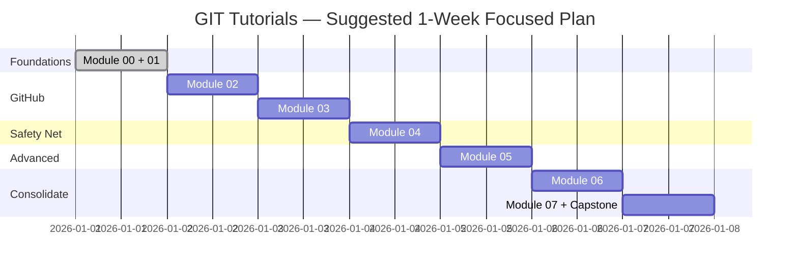

<div align="center">

# 🏁 Module 07 — Exercises & Study Plan (Capstone)


**Reading got you here. This module is where reading turns into muscle memory — the only thing that actually sticks.**

</div>

---

## 📑 In This Module

- [Syllabus — The Whole Course, One Page](#-syllabus--the-whole-course-one-page)
- [Study Plan — Suggested Pacing](#-study-plan--suggested-pacing)
- [Exercises — Progressive, By Module](#-exercises--progressive-by-module)
- [Capstone Exercise — One Continuous Scenario](#-capstone-exercise--one-continuous-scenario)
- [Quiz Bank](#-quiz-bank)
- [You're Done — Now What](#-youre-done--now-what)

---

## 📚 Syllabus — The Whole Course, One Page

```
00 → Introduction & Setup        Version control concepts, install, config
01 → Git Fundamentals            Staging, commits, branching, merging — the daily loop
02 → Git + GitHub                SSH, remotes, push/pull, GitHub Flow, Pages
03 → Contributing to Open Source Fork, clone, pull requests
04 → Undo & Recovery             Revert, reset, amend, rebase, reflog
05 → Advanced Git                gitignore/attributes, LFS, signing, hooks, submodules, CI/CD
06 → Certification Prep          Structured review + exam-style practice
07 → Exercises & Study Plan      ← you are here
```

Each module has its own Quick Check-In at the end — if you skipped any of those, this is a good
moment to go back and actually answer them before diving into the exercises below.

---

## 🗓️ Study Plan — Suggested Pacing

| Pace | Schedule | Total Time |
|---|---|---|
| **Relaxed** | 1 module every 2-3 days, 30-45 min/day | ~3 weeks |
| **Focused** | 1 module/day | ~1 week |
| **Cram** (not recommended, but real) | 2-3 modules/day | 2-3 days |

> [!TIP]
> The "Relaxed" pace isn't the slow option for people who can't commit — it's genuinely the one
> that produces better retention. Git concepts (especially branching, rebase, and conflict
> resolution) benefit enormously from **spaced repetition**: read it, sleep on it, use it in a
> real scenario, revisit it. Cramming all 8 modules in one sitting produces recognition ("oh
> yeah, I read that"), not the actual recall you need mid-interview or mid-incident.

**Suggested week-by-week (Focused pace):**



---

## 💪 Exercises — Progressive, By Module

### Module 00–01 Exercise: "Your First Real Repo"
1. `git init` a new folder for a genuinely simple project (a personal notes app, a to-do list —
   doesn't matter what, it just needs to exist)
2. Make 5 separate, meaningful commits, each with a proper message (not "update", not "fix")
3. Create a branch, make 2 more commits on it, merge it back into `main`
4. Run `git log --oneline --graph --all` and actually read the shape of what you built

### Module 02 Exercise: "Push It Somewhere Real"
1. Set up SSH authentication with GitHub (if you haven't already)
2. Create a new empty repo on GitHub, connect your local repo from above as `origin`
3. Push everything
4. Make one more change directly via the GitHub web editor, then `git pull` it down locally

### Module 03 Exercise: "Your First Real Contribution"
1. Find a small open-source project with a `good first issue` label (search GitHub's issue
   filters, or check [goodfirstissue.dev](https://goodfirstissue.dev/))
2. Fork it, clone your fork, make the fix on a properly named branch
3. Open a real Pull Request — even if it's just a documentation typo fix. This is genuinely one
   of the highest-value 30-minute exercises in this entire course.

### Module 04 Exercise: "Break It on Purpose, Then Fix It"
1. In a throwaway test repo, make 3 commits
2. `git reset --hard HEAD~2` (deliberately "lose" 2 commits)
3. Use `git reflog` to find and recover them
4. Now deliberately create a merge conflict (edit the same line on two branches), resolve it
   properly, and commit the resolution

### Module 05 Exercise: "Set Up a Real Safety Net"
1. Add a proper `.gitignore` to a project using [gitignore.io](https://www.toptal.com/developers/gitignore)
2. Set up a `pre-commit` hook that runs a linter or even just `echo "committing..."` as a first test
3. Cherry-pick one specific commit from one branch onto another

---

## 🎯 Capstone Exercise — One Continuous Scenario

Do this as one continuous exercise, using everything from Modules 00–05 together — this is the
single best way to confirm the concepts actually connected into one coherent mental model, not
just isolated facts:

1. Create a new GitHub repo for a small project (anything — a script, a simple app, doesn't
   matter)
2. Set up `.gitignore` properly from the start
3. Work in feature branches for every change — never commit directly to `main`
4. Push every branch, open a real Pull Request for each one (even solo, reviewing your own PR is
   good practice), merge via GitHub
5. Deliberately create one merge conflict between two branches and resolve it
6. Make one commit with a typo in the message, `--amend` it before pushing
7. Push a bad commit, then `revert` it cleanly
8. Tag a "release" with an annotated tag
9. Add a `pre-commit` hook that checks something trivial
10. Write a clean, genuinely good README for the finished project

If you can do all 10 steps without needing to look anything up beyond a quick syntax check, you've
completed this course in the way that actually matters — not "read about Git" but "can use Git."

---

## 🧠 Quiz Bank

Quick self-test — cover the answers, go through all 20, then check yourself.

1. What command turns an ordinary folder into a Git repository?
2. What's the difference between the working directory, staging area, and repository?
3. What does `git status` show you?
4. Why is `"fixed it"` a bad commit message?
5. What's a fast-forward merge?
6. When would you use `git stash` instead of committing?
7. What's the difference between `git branch -d` and `git branch -D`?
8. What does `git log --oneline` show that plain `git log` doesn't (in terms of readability)?
9. What's an annotated tag, and why prefer it over a lightweight one for releases?
10. What's the actual difference between `git fetch` and `git pull`?
11. Why would you use SSH keys instead of a password for GitHub?
12. In a fork-based workflow, what does `upstream` refer to?
13. What makes a Pull Request likely to get merged quickly?
14. `git revert` vs `git reset` — which is safe on a shared, already-pushed branch?
15. What's the difference between `--soft`, `--mixed`, and `--hard` reset?
16. What can `git reflog` recover, and what can it never recover?
17. Why is rebasing a shared branch dangerous?
18. What's the actual job of `.gitignore` vs `.gitattributes`?
19. What are the three sections inside a merge conflict's `<<<<<<<`/`=======`/`>>>>>>>` markers?
20. What's the difference between a Git hook and a CI/CD check?

**Answers:** every single one of these is directly covered in Modules 00–05 — if any felt shaky,
that's your specific, targeted review list. Don't re-read whole modules; jump straight to the
section that answers the question you missed.

---

## 🎉 You're Done — Now What

You started this course not knowing the difference between Git and GitHub. You now know staging,
committing, branching, merging, remotes, forking, pull requests, reverting, resetting, rebasing,
reflog-based recovery, conflict resolution, hooks, and CI/CD integration — genuinely the full
range of what "knows Git" means in a real job.

**What actually cements this long-term:**
- Use it. Every single project, from here forward, gets proper commits and branches — not just
  "big-bang" single commits at the end
- Contribute to at least one more open-source project beyond the capstone exercise
- When you hit something new (a Git error message you've never seen, a workflow you haven't
  used), that's not a sign you're behind — that's just Git, which has genuine depth even senior
  engineers keep learning from

> [!IMPORTANT]
> If you found this course useful, the best way to "pay it forward" is exactly what got you
> here: explain a Git concept to someone else, using a real-life analogy instead of jargon. That's
> the whole teaching philosophy this course was built on — pass it on.

---

<div align="center">

**[⬆ Back to Top](#-module-07--exercises--study-plan-capstone)** | **[🏠 Main README](../README.md)** | **[← Previous: Certification Prep](../06-certification-prep/)**

**You went from `git init` to resolving merge conflicts and recovering "lost" commits with reflog. That's not nothing — that's Git.**

</div>
