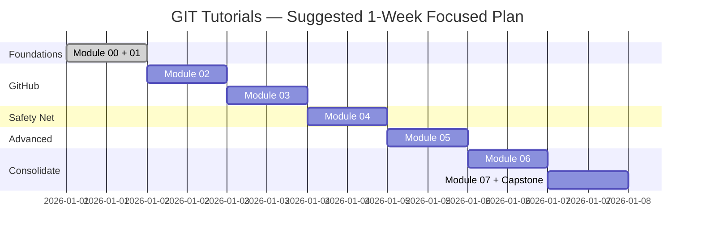

<div align="center" markdown="1">

# 🏁 Module 07 — Exercises & Study Plan (Capstone)


**Reading got you here. This module is where reading turns into muscle memory — the only thing that actually sticks.**

</div>

<div class="callout callout-concept" markdown="1">

**By the end of this module you will be able to:**

✓ Run the full branch → commit → PR → merge → recover → bisect loop from memory, not notes
✓ Self-assess exactly which modules need a second pass, using the quiz bank
✓ Point at a real, well-organized Git history as proof you know this, not just a certificate

</div>

---

## 📑 In This Module

- [Syllabus — The Whole Course, One Page](#-syllabus--the-whole-course-one-page)
- [Study Plan — Suggested Pacing](#-study-plan--suggested-pacing)
- [Exercises — Progressive, By Module](#-exercises--progressive-by-module)
- [🏆 Git Mastery Challenge (Capstone)](#-git-mastery-challenge-capstone)
- [Quiz Bank](#-quiz-bank)
- [You're Done — Now What](#-youre-done--now-what)

---

## 📚 Syllabus — The Whole Course, One Page

```
00 → Introduction & Setup        Version control concepts, install, config
01 → Git Fundamentals            Staging, commits, branching, merging — the daily loop
02 → Git + GitHub                SSH, remotes, push/pull, GitHub Flow, Pages
03 → Contributing to Open Source Fork, clone, pull requests
04 → Undo & Recovery             Revert, reset, amend, rebase, reflog
05 → Advanced Git                gitignore/attributes, LFS, signing, hooks, submodules, CI/CD
06 → Certification Prep          Structured review + exam-style practice
07 → Exercises & Study Plan      ← you are here
```

Each module has its own Quick Check-In at the end — if you skipped any of those, this is a good
moment to go back and actually answer them before diving into the exercises below.

---

## 🗓️ Study Plan — Suggested Pacing

| Pace | Schedule | Total Time |
|---|---|---|
| **Relaxed** | 1 module every 2-3 days, 30-45 min/day | ~3 weeks |
| **Focused** | 1 module/day | ~1 week |
| **Cram** (not recommended, but real) | 2-3 modules/day | 2-3 days |

> [!TIP]
> The "Relaxed" pace isn't the slow option for people who can't commit — it's genuinely the one
> that produces better retention. Git concepts (especially branching, rebase, and conflict
> resolution) benefit enormously from **spaced repetition**: read it, sleep on it, use it in a
> real scenario, revisit it. Cramming all 8 modules in one sitting produces recognition ("oh
> yeah, I read that"), not the actual recall you need mid-interview or mid-incident.

**Suggested week-by-week (Focused pace):**


```mermaid
gantt
    title GIT Tutorials — Suggested 1-Week Focused Plan
    dateFormat YYYY-MM-DD
    section Foundations
    Module 00 + 01           :done, m1, 2026-01-01, 1d
    section GitHub
    Module 02                :m2, after m1, 1d
    Module 03                :m3, after m2, 1d
    section Safety Net
    Module 04                :m4, after m3, 1d
    section Advanced
    Module 05                :m5, after m4, 1d
    section Consolidate
    Module 06                :m6, after m5, 1d
    Module 07 + Capstone     :m7, after m6, 1d
```

---

## 💪 Exercises — Progressive, By Module

### Module 00–01 Exercise: "Your First Real Repo"
1. `git init` a new folder for a genuinely simple project (a personal notes app, a to-do list —
   doesn't matter what, it just needs to exist)
2. Make 5 separate, meaningful commits, each with a proper message (not "update", not "fix")
3. Create a branch, make 2 more commits on it, merge it back into `main`
4. Run `git log --oneline --graph --all` and actually read the shape of what you built

### Module 02 Exercise: "Push It Somewhere Real"
1. Set up SSH authentication with GitHub (if you haven't already)
2. Create a new empty repo on GitHub, connect your local repo from above as `origin`
3. Push everything
4. Make one more change directly via the GitHub web editor, then `git pull` it down locally

### Module 03 Exercise: "Your First Real Contribution"
1. Find a small open-source project with a `good first issue` label (search GitHub's issue
   filters, or check [goodfirstissue.dev](https://goodfirstissue.dev/))
2. Fork it, clone your fork, make the fix on a properly named branch
3. Open a real Pull Request — even if it's just a documentation typo fix. This is genuinely one
   of the highest-value 30-minute exercises in this entire course.

### Module 04 Exercise: "Break It on Purpose, Then Fix It"
1. In a throwaway test repo, make 3 commits
2. `git reset --hard HEAD~2` (deliberately "lose" 2 commits)
3. Use `git reflog` to find and recover them
4. Now deliberately create a merge conflict (edit the same line on two branches), resolve it
   properly, and commit the resolution

### Module 05 Exercise: "Set Up a Real Safety Net"
1. Add a proper `.gitignore` to a project using [gitignore.io](https://www.toptal.com/developers/gitignore)
2. Set up a `pre-commit` hook that runs a linter or even just `echo "committing..."` as a first test
3. Cherry-pick one specific commit from one branch onto another

---

## 🏆 Git Mastery Challenge (Capstone)

This is the final "prove you can actually use Git" exercise — one continuous scenario using
everything from Modules 00–05 together, the single best way to confirm the concepts connected
into one coherent mental model instead of staying isolated facts.

<div class="callout callout-challenge" markdown="1">

**🎯 THE SCENARIO**

You're working on a small automation project. Starting from a fresh GitHub repo, you need to:

1. Set up `.gitignore` properly from the start
2. Create a feature branch, make commits, push it
3. Open a real Pull Request and merge it via GitHub
4. Deliberately create a merge conflict between two branches, and resolve it
5. Rebase a local feature branch onto `main` before opening its PR
6. Make a commit with a typo in the message, `--amend` it before pushing
7. Push a bad commit, then `revert` it cleanly on a branch that's already shared
8. Deliberately "lose" a commit with `reset --hard`, then recover it with `reflog`
9. Use `git bisect` to identify exactly which of several commits introduced a deliberately
   planted bug
10. Tag a release, add a `pre-commit` hook, and write a clean, genuinely good README

Don't look at the hints yet. Try the whole thing from memory first — that's the actual point.

</div>

<details>
<summary>💡 Stuck? Hints (not the solution)</summary>

- Steps 1–4 are the GitHub Flow loop from Module 02, plus the conflict lab from Module 04
- Step 5: rebase your feature branch *before* opening the PR, not after — that's the whole reason
  teams rebase local branches instead of `main`
- Step 8 only works if the "lost" commit was actually committed first — `reflog` can't rescue
  uncommitted changes, by design
- Step 9: plant a bug in one commit among several on purpose, mark the current state `bad`, an
  earlier known-good commit `good`, and either bisect manually or write one script you can hand
  to `git bisect run`

</details>

<details>
<summary>💡 Partial solution — steps 1–4</summary>

```bash
git init my-automation-project && cd my-automation-project
echo "node_modules/" > .gitignore && echo ".env" >> .gitignore
git add .gitignore && git commit -m "chore: initial gitignore"
git remote add origin <your-empty-github-repo-url>
git push -u origin main

git switch -c feature/first-change
echo "feature work" >> feature.js && git add feature.js
git commit -m "feat: first change"
git push -u origin feature/first-change
# Open the PR on GitHub, merge it, then locally:
git switch main && git pull
```

</details>

<details>
<summary>💡 Complete solution — all 10 steps</summary>

Steps 5–10, continuing from the state above:

```bash
# 5. Rebase before opening a PR
git switch -c feature/second-change
echo "more work" >> feature2.js && git add feature2.js && git commit -m "feat: second change"
git fetch origin && git rebase origin/main

# 6. Amend a typo'd message before pushing
git commit --allow-empty -m "fx: typo"
git commit --amend -m "fix: corrected message"

# 7. Revert a bad commit already shared
git push -u origin feature/second-change
echo "oops" >> feature2.js && git add feature2.js && git commit -m "feat: broken change" && git push
git revert --no-edit HEAD && git push

# 8. Lose and recover a commit
echo "important" >> feature2.js && git add feature2.js && git commit -m "feat: important work"
git reset --hard HEAD~1
git reflog
git branch recovered HEAD@{1}

# 9. Bisect a planted regression (simplified — exit code stands in for a real test)
git bisect start
git bisect bad HEAD
git bisect good <some-earlier-good-commit>
# Git checks out a midpoint each round — inspect it, then:
git bisect good   # or: git bisect bad
# ...until Git reports the first bad commit, then:
git bisect reset

# 10. Tag, hook, README
git tag -a v1.0.0 -m "First release"
echo '#!/bin/sh\necho "checking..."' > .git/hooks/pre-commit && chmod +x .git/hooks/pre-commit
# Write the README by hand — this part doesn't have a shortcut
```

</details>

<details>
<summary>💡 Explanation — why these 10 steps specifically</summary>

Every step maps to a real failure mode this course spent a whole module on: steps 1–4 are the
daily loop (Modules 01–02), step 5 is the "clean up before review" habit senior engineers expect,
steps 6–8 are Module 04's safety net exercised for real, step 9 is the single highest-leverage
debugging skill this course teaches, and step 10 is "does your own repo practice what this course
preaches" — the same bar [Module 04's Disaster Labs](../04-undo-and-recovery/#-disaster-labs) and
this very repository hold themselves to.

</details>

If you can do all 10 steps — even needing the hints, not the full solution — you've completed
this course in the way that actually matters: not "read about Git" but "can use Git."

---

## 🧠 Quiz Bank

Quick self-test — cover the answers, go through all 20, then check yourself.

1. What command turns an ordinary folder into a Git repository?
2. What's the difference between the working directory, staging area, and repository?
3. What does `git status` show you?
4. Why is `"fixed it"` a bad commit message?
5. What's a fast-forward merge?
6. When would you use `git stash` instead of committing?
7. What's the difference between `git branch -d` and `git branch -D`?
8. What does `git log --oneline` show that plain `git log` doesn't (in terms of readability)?
9. What's an annotated tag, and why prefer it over a lightweight one for releases?
10. What's the actual difference between `git fetch` and `git pull`?
11. Why would you use SSH keys instead of a password for GitHub?
12. In a fork-based workflow, what does `upstream` refer to?
13. What makes a Pull Request likely to get merged quickly?
14. `git revert` vs `git reset` — which is safe on a shared, already-pushed branch?
15. What's the difference between `--soft`, `--mixed`, and `--hard` reset?
16. What can `git reflog` recover, and what can it never recover?
17. Why is rebasing a shared branch dangerous?
18. What's the actual job of `.gitignore` vs `.gitattributes`?
19. What are the three sections inside a merge conflict's `<<<<<<<`/`=======`/`>>>>>>>` markers?
20. What's the difference between a Git hook and a CI/CD check?
21. What does "detached HEAD" actually mean, and is it dangerous by itself?
22. Why does `git bisect run` need a command with an exit code, not just a file to look at?

**Answers:** every single one of these is directly covered in Modules 00–05 — if any felt shaky,
that's your specific, targeted review list. Don't re-read whole modules; jump straight to the
section that answers the question you missed.

---

## 🎉 You're Done — Now What

You started this course not knowing the difference between Git and GitHub. You now know staging,
committing, branching, merging, remotes, forking, pull requests, reverting, resetting, rebasing,
reflog-based recovery, conflict resolution, hooks, and CI/CD integration — genuinely the full
range of what "knows Git" means in a real job.

**What actually cements this long-term:**
- Use it. Every single project, from here forward, gets proper commits and branches — not just
  "big-bang" single commits at the end
- Contribute to at least one more open-source project beyond the capstone exercise
- When you hit something new (a Git error message you've never seen, a workflow you haven't
  used), that's not a sign you're behind — that's just Git, which has genuine depth even senior
  engineers keep learning from

> [!IMPORTANT]
> If you found this course useful, the best way to "pay it forward" is exactly what got you
> here: explain a Git concept to someone else, using a real-life analogy instead of jargon. That's
> the whole teaching philosophy this course was built on — pass it on.

---

<div align="center" markdown="1">

**[⬆ Back to Top](#-module-07--exercises--study-plan-capstone)** | **[🏠 Main README](../README.md)** | **[← Previous: Certification Prep](../06-certification-prep/)**

**You went from `git init` to resolving merge conflicts and recovering "lost" commits with reflog. That's not nothing — that's Git.**

</div>
