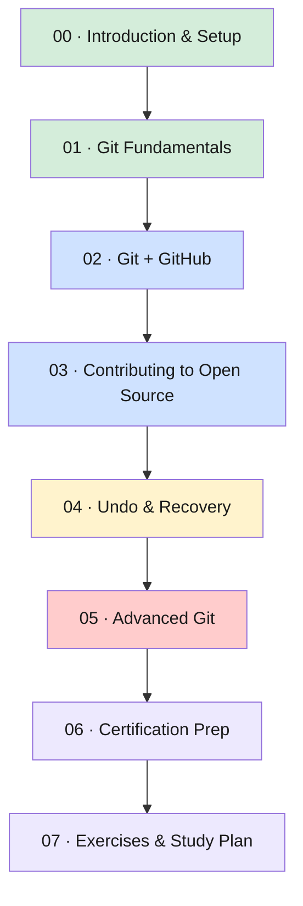

# 🐙 GIT Tutorials — From `git init` to "wait, how do I undo this"

**🌐 Browse it live:** [ghanendra-sdet.github.io/git-tutorials](https://ghanendra-sdet.github.io/git-tutorials/)  
**📦 View source on GitHub:** [github.com/ghanendra-sdet/git-tutorials](https://github.com/ghanendra-sdet/git-tutorials)

<em>Progress is tracked only in your own browser (localStorage) — no login, nothing sent anywhere. The checklist above will stay empty until JavaScript runs, on the live site.</em>

---

## Why this exists

Every Git tutorial on the internet teaches you `git add`, `git commit`, `git push` and then
abandons you the moment something actually goes wrong — which, statistically, is about Tuesday.
This one is different for three reasons:

1. **It explains *why*, not just *what*.** `git stash` isn't just "a command" — it's a specific
   answer to a specific panic ("my boss is walking over and my code is a disaster"). Once you know
   the panic, the command makes sense forever.
2. **Every topic gets two examples, not one.** A real-life analogy (so the *concept* clicks) and
   a technical example (so you can actually *type it*). Concepts without commands are trivia.
   Commands without concepts are cargo-culting.
3. **It doesn't pretend Git is scary.** Git has a genuinely rough reputation — three-hour merge
   conflicts, a detached HEAD you didn't ask for, `git reflog` as the nuclear "please give me my
   commits back" button. We're going to laugh about all of it, then actually learn it.

> [!IMPORTANT]
> Git is not optional knowledge for a developer or SDET — it's closer to "knowing how to use a
> keyboard." This course assumes zero prior Git knowledge and gets you to genuinely advanced
> topics (rebase, hooks, submodules, CI/CD integration) by the end.

---

## 🗺️ The Path

| # | Module | Level | "In one sentence" |
|---|---|---|---|
| 00 | [Introduction & Setup](./00-introduction/) | 🟢 Beginner | What even is version control, and why does everyone use this one |
| 01 | [Git Fundamentals](./01-git-fundamentals/) | 🟢 Beginner | The 90% of Git you'll use every single day |
| 02 | [Git + GitHub](./02-git-and-github/) | 🟢 Beginner→Intermediate | Your laptop's Git talking to the internet's Git |
| 03 | [Contributing to Open Source](./03-contributing-to-open-source/) | 🔵 Intermediate | Fork, clone, pull request, profit (reputation-wise) |
| 04 | [Undo & Recovery](./04-undo-and-recovery/) | 🔵 Intermediate | You didn't break it. Well — you did. But it's fixable |
| 05 | [Advanced Git](./05-advanced-git/) | 🔴 Advanced | The stuff that shows up in senior job descriptions |
| 06 | [Certification Prep](./06-certification-prep/) | 🟣 All levels | Prove it, on paper |
| 07 | [Exercises & Study Plan](./07-exercises-and-study-plan/) | 🟣 All levels | Stop reading, start typing |

Follow the numbers in order for modules 00–02 — everything after that builds directly on branching
and merging, which is the one concept you genuinely cannot skip.

---

## 📚 Modules

### 00 · Introduction & Setup
**Level:** Beginner
What version control actually is, installing Git, the *one-time* config that saves you from
"who is `DESKTOP-8H3JX92`" in your commit history, and where to go when you're stuck.
📂 [`00-introduction/`](./00-introduction/)

### 01 · Git Fundamentals
**Level:** Beginner
The staging area, commits, history, branching, and merging — the core loop you'll run hundreds
of times a week for the rest of your career. If you only ever learn one module properly, make it
this one.
📂 [`01-git-fundamentals/`](./01-git-fundamentals/)

### 02 · Git + GitHub
**Level:** Beginner → Intermediate
SSH keys, remotes, push/pull, GitHub-specific branching workflows, and GitHub Pages. This is
where "Git on my machine" becomes "Git the internet can see."
📂 [`02-git-and-github/`](./02-git-and-github/)

### 03 · Contributing to Open Source
**Level:** Intermediate
Fork, clone, branch, pull request — the exact sequence behind literally every open-source
contribution you've ever seen on GitHub.
📂 [`03-contributing-to-open-source/`](./03-contributing-to-open-source/)

### 04 · Undo & Recovery
**Level:** Intermediate
Revert, reset, amend, rebase, reflog. The module that turns "I think I just deleted three days
of work" from a crisis into a Tuesday-afternoon inconvenience.
📂 [`04-undo-and-recovery/`](./04-undo-and-recovery/)

### 05 · Advanced Git
**Level:** Advanced
`.gitignore`/`.gitattributes`, LFS, signed commits, cherry-picking, merge conflict resolution,
CI/CD integration, hooks, submodules. The stuff that separates "I've used Git" from "I understand
Git."
📂 [`05-advanced-git/`](./05-advanced-git/)

### 06 · Certification Prep
**Level:** All levels (review)
A structured review pass across every module, framed as certification-style prep.
📂 [`06-certification-prep/`](./06-certification-prep/)

### 07 · Exercises & Study Plan (Capstone)
**Level:** All levels
Hands-on exercises, a quiz bank, and a study plan tying every module together into one
progression. This is where reading turns into muscle memory.
📂 [`07-exercises-and-study-plan/`](./07-exercises-and-study-plan/)

---

## 🧠 Practice & Recall

Reading a module once won't make the commands stick — using them will. Four resources built
specifically for that:

- **[Git Playground](./resources/playground.html)** — a real terminal against a simulated local
  repo *and* a remote called `origin`, side by side. Type actual `git` commands and watch
  branching, merging, push and pull happen on a live, dual commit graph. A "try next" chip reads
  your repo's actual state to suggest a next step — it's a hint, never a gate: whatever you type
  and hit Enter on always runs.
- **[Interactive Cheatsheet Matrix](./resources/interactive-cheatsheet.html)** — every command,
  searchable and filterable by "how much you're panicking," with one-click copy and a live,
  consequence-free visual Git tree sandbox (click "commit," "branch," "merge" and watch the graph
  update in real time).
- **[Command Recall Drill](./resources/command-recall-drill.md)** — scenario-based, fold-to-reveal
  quizzing across every module. Do 10-15 a day, not all of them at once — this is spaced
  repetition, not a reading list.
- **[Cheatsheet](./resources/cheatsheet.md)** — a flat, one-page reference for when you already
  know the command and just blanked on the exact flag.

---

## 🎓 Who this is for

| You are... | You'll get... |
|---|---|
| A total beginner who's only ever used "Save As... final_v2_FINAL.docx" | A real reason `git commit` beats that, and how to never do it again |
| A developer/QA who uses 5 Git commands on autopilot and panics at the other 95 | The mental model behind *why* those commands work, not just muscle memory |
| Someone who's caused (or survived) a merge conflict disaster | Module 04 and 05, specifically written for you |
| Prepping for a Git-related interview question or certification | Module 06 |

---

## 🛠️ What You'll Need

- Git installed (Module 00 covers this for Windows/Mac/Linux)
- A free [GitHub](https://github.com) account (for Module 02 onward)
- A terminal and a text editor — that's genuinely it

---

## 📄 License

MIT — see [LICENSE](LICENSE).

---

### 📚 [Start with Module 00 →](./00-introduction/)

**Happy committing — may your merge conflicts be rare and your `git blame` results be kind.**

